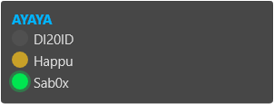

# TeamSpeak 6 Overlay Skin for Rainmeter (TS6 Desktop Widget / rainyTS)

A lightweight, fully customizable **Rainmeter skin** that acts as a real-time **TeamSpeak 6 (TS6)** voice channel overlay widget. Monitor your active voice server, see who is connected, and track live talking status indicators directly on your desktop window - eliminating the need to tab out of games.

It connects securely via the TS6 Remote Apps WebSocket API and features automatic server switching when handling multiple simultaneous TeamSpeak connections.




---

## Key Features

- **Live TS6 Speaker Status:** Real-time visual feedback tracking who is actively talking.
- **Voice Channel Monitor:** Displays current active channel name and total connected user list.
- **Status Indicator Icons:** Dynamic tags for microphone and audio status &emsp;  &nbsp;  &nbsp;  &nbsp; .
- **Multi-Server Support:** Automatically shifts focus to display the TS6 channel you spoke in last.
- **Smart Auto-Hide:** The desktop widget automatically hides itself when disconnected from TeamSpeak.
- **Dynamic UI Height:** Interface automatically expands or shrinks based on the number of users in the channel (supports up to 24 simultaneous users).

---

## Prerequisites & Dependencies

Before setting up the TeamSpeak 6 overlay, ensure your system has the following core components installed:

| Dependency | Required Version | Purpose |
|---|---|---|
| [Rainmeter](https://www.rainmeter.net/)  | `4.5+` | The open-source desktop widget customization engine |
| [PowerShell](https://learn.microsoft.com/en-us/powershell/)  | `7+ (pwsh)` | Required back-end environment for skin execution |
| [TeamSpeak 6](https://www.teamspeak.com/) | Client App | Must support and have the **Remote Apps** feature enabled |

---

## Installation & Setup Guide

### 1. Enable TeamSpeak Remote Apps API
1. Open your **TeamSpeak 6** client.
2. Navigate to **Settings** > **Remote Apps**.
3. Toggle the option to **"Enabled"**. Keep this settings window open during the initial skin launch.

### 2. Install the Rainmeter Skin

#### Method A: Automatic Installation (Recommended)
1. Download the latest `.rmskin` package from the [GitHub Releases](https://github.com/h4ppywastaken/rainyTS/releases) page.
2. Double-click the downloaded `rainyTS.rmskin` file. Rainmeter will handle the installation automatically.
3. Load the skin using the Rainmeter Manage dialog.

#### Method B: Manual Installation (Git Clone)
1. Clone or extract this repository directly into your local Rainmeter `Skins` directory:
   ```cmd
   %USERPROFILE%\Documents\Rainmeter\Skins
   ```
2. Open the Rainmeter Manage window (right-click Rainmeter system tray icon > **Manage**).
3. Click **Refresh all**, locate **rainyTS** in the skin library list, and click **Load**.

### 3. Authorize the TS6 Desktop Widget
1. Upon first run, TeamSpeak 6 will display an incoming connection permission request notification. *(If it does not appear, try reloading the skin in Rainmeter).*
2. Click **Accept**. The voice overlay will securely encrypt and store your authorized API key inside `@Resources\TS6ApiKey.clixml`.

---

## UI Customization & Configuration

You can fully customize layout limits, HEX color codes, and connection variables by editing the configuration file located at `@Resources\Settings.inc`:

```ini
TS6_Host=127.0.0.1     ; TeamSpeak Remote Apps local host
TS6_Port=5899          ; Default Remote Apps WebSocket port
MaxUsers=24            ; Maximum visible user capacity for the widget UI

ColorBG=20,20,20,200   ; RGB background overlay transparency
ColorTalk=0,230,80,255 ; Active speaking user indicator color
ColorIdle=80,80,80,255 ; Idle client text color
..., etc.
```

---

## Technical Architecture & How It Works

This TeamSpeak widget relies on a multi-tier script framework to ensure low CPU usage and lightweight rendering:

1. **PowerShell Core Back-end** (`@Resources\TS6Client.ps1`)
   - Establishes a persistent connection to TS6 via the WebSocket API.
   - Listens for server events such as `clientMoved`, `talkStatusChanged`, and `connectStatusChanged`.
   - Constantly writes the normalized channel payload state directly into `TS6Data.txt`.

2. **Lua Controller Script** (`@Resources\Script.lua`)
   - Ticks on a 250 ms Rainmeter update cycle to read `TS6Data.txt`.
   - Modifies UI elements on-the-fly and triggers the auto-hide state when connection drops.

3. **Data Buffer Interface** (`TS6Data.txt`)
   ```text
   ChannelName|UserCount
   ClientId|Nickname|TalkStatus|IsSelf|InputMuted|OutputMuted
   ClientId|Nickname|TalkStatus|IsSelf|InputMuted|OutputMuted
   ...
   ```

---

## Troubleshooting & Debugging

If the voice overlay is not displaying active channel data, you can debug the WebSocket back-end connection independently from Rainmeter:

```cmd
Start-rainyTS.cmd
```
This execution script spins up a dedicated terminal window displaying real-time stream logs from the TeamSpeak Remote Apps API.

---

## Support & Contributions

If you find this overlay useful for your gaming setup, considerations for donations are greatly appreciated:

[](https://paypal.me/h4ppywastaken)

## License

Distributed under the open-source **MIT License**. See `LICENSE` for details.